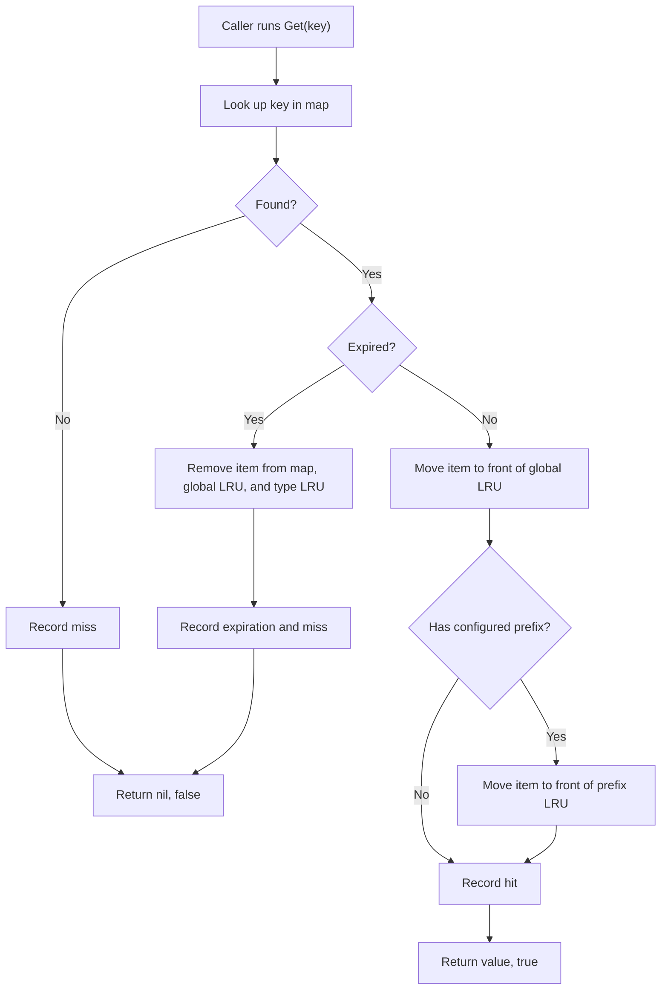
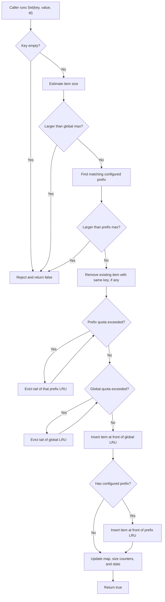

# ProcessCache Algorithm Explained

This document explains the cache algorithm in beginner-friendly language. The
implementation is in `internal/processcache`, while the public API is exposed
from `processcache.go`.

## What Problem This Cache Solves

ProcessCache keeps recently used values inside one Go process so reads can be
very fast and do not need Redis, Memcached, a database, or another sidecar.

It has three main responsibilities:

- Find a value by key quickly.
- Keep memory usage bounded.
- Remove the least recently used entries when space is needed.

## The Core Idea

The cache combines two data structures:

- A hash map: `map[string]*item`
- Doubly-linked lists: `container/list`

The map answers "do we have this key?" in O(1) average time. The linked lists
answer "which entry is oldest?" in O(1) time.

This is the standard LRU cache pattern:

```text
map[key] -> item -> linked-list node
```

When an item is used, its linked-list node moves to the front. The front means
"most recently used". The back means "least recently used". When the cache needs
space, it removes the back item.

## Why There Is More Than One List

ProcessCache supports two kinds of limits:

- A global limit for the whole cache.
- Optional per-prefix limits, such as `session:` or `username:`.

A single global LRU list is enough for global eviction, but it is not enough for
fast type-scoped eviction.

For example, if `session:` has its own limit, the cache must quickly answer:

```text
What is the oldest session item?
```

Scanning the global list until a `session:` key appears would be O(n). To avoid
that, ProcessCache keeps:

- One global doubly-linked list for all items.
- One doubly-linked list per configured prefix.

Each item with a configured prefix has two list nodes:

- One node in the global list.
- One node in that prefix's type list.

That makes both global eviction and prefix eviction O(1).

## Get Flow

`Get` looks up the key, removes it if expired, and promotes it to most recently
used when it is still valid.



## Set Flow

`Set` estimates the item size, checks limits, evicts old entries if needed, and
then inserts the new item at the front of the LRU lists.



## Delete, Exists, Clear, And Close

`Delete` removes the item from the map, global list, optional prefix list, and
size counters.

`Exists` behaves like a lightweight `Get`: it checks the map and lazily removes
expired items, but it does not return the value.

`Clear` removes all entries and resets size accounting, but it does not reset
lifetime stats counters.

`Close` stops the background cleanup goroutine. It is safe to call more than
once. After `Close`, the cache still works, but expired entries are only removed
when `Get` or `Exists` touches them.

## Expiration

Expiration works in two ways:

- Lazy expiration on `Get` and `Exists`.
- Background cleanup on a timer.

Lazy expiration is important because it guarantees an expired item is not
returned, even if the background cleanup has not run yet.

The background cleanup exists for entries that expire and are never read again.
It periodically scans all items and removes expired ones.

## Big-O Summary

| Operation | Average Cost | Why |
| --- | ---: | --- |
| `Get` hit | O(1) | Map lookup plus linked-list move |
| `Get` miss | O(1) | Map lookup |
| `Set` without eviction | O(1) average | Map insert plus linked-list insert |
| Global eviction | O(1) | Remove global list tail |
| Prefix eviction | O(1) | Remove prefix list tail |
| `Delete` | O(1) average | Map lookup plus linked-list remove |
| Background cleanup | O(n) per sweep | It scans all items |

Prefix matching is O(p), where `p` is the number of configured prefixes. This is
expected to be small, and overlapping prefixes are rejected during construction
so accounting remains deterministic.

## Important Tradeoffs

ProcessCache chooses exact LRU ordering over lock-free reads. That means all
cache operations use one internal mutex because even a successful `Get` changes
LRU order.

This is a good fit when:

- You want a simple in-process cache.
- You need predictable global and per-prefix LRU eviction.
- You do not want external infrastructure.
- Your cached data is local to one Go process.

Use Redis, Memcached, or another shared cache when:

- Multiple processes must share cache state.
- Cache data must survive process restarts.
- You need cross-service invalidation.
- You need centralized memory management.

## Mental Model

Think of the cache as two coordinated indexes over the same items:

```text
Fast lookup:
  map["session:123"] -> item

Global recency:
  newest <-> ... <-> oldest

Prefix recency for "session:":
  newest session <-> ... <-> oldest session
```

Every insert, read, delete, expiration, and eviction keeps those structures in
sync. The private removal path updates the map, both lists, and size counters
together so the cache does not double-count or leak entries.
